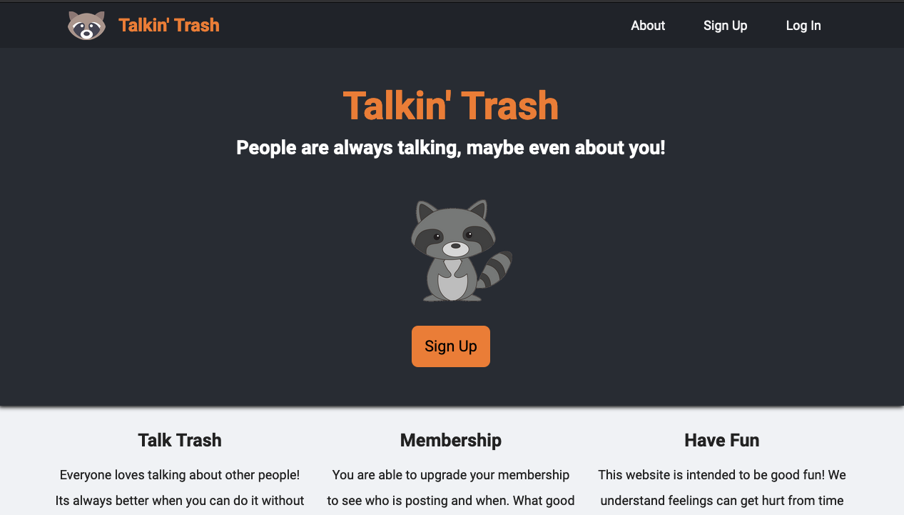
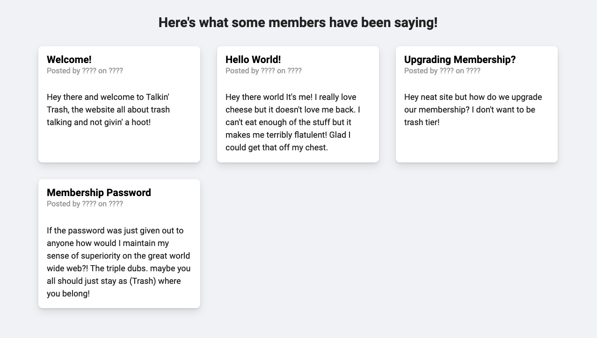

# Talkin' Trash

Talkin' Trash is a website made based on the Node.JS curriculum of [The Odin Project](https://www.theodinproject.com/home). This website was made to further my understanding of creating a back-end with express and also to introduce authentication with the help of Passport.JS.

[Live Demo](https://talkin-trash.herokuapp.com/)

## Learning Objectives

- Further my knowledge of [Express](https://expressjs.com/) and [Node.JS](https://nodejs.org/en/)
- Implement a local authorization strategy with [Passport.JS](http://www.passportjs.org/)
- Improve my understanding of [MongoDB](https://www.mongodb.com/) and [Mongoose](https://mongoosejs.com/)
- Develop a better understanding of [PUG](https://pugjs.org/api/getting-started.html)
- Use [Sass](https://sass-lang.com/) to partition stylesheets based on components
- Make a website more responsive to various viewports
- Improve my overall design ideas and layout structuring
- Make my code more modular and partitioned overall

## Features

Talkin' Trash utilizes conditional rendering to show or hide user information based around a membership level - anyone can sign up but only users with a membership can see other user's info.

## Images

## License

[MIT](https://choosealicense.com/licenses/mit/)
